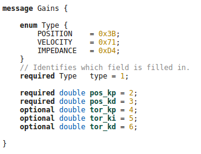

.. _background:

***************
Background
***************

.. _ZeroMQ:

ZMQ Mechanism
=============================

`ZeroMQ <https://zeromq.org>`__ (also spelled ØMQ, 0MQ or ZMQ) is a high-performance asynchronous messaging library, aimed at use in distributed or concurrent applications. It provides a message queue, but unlike message-oriented middleware, a ZeroMQ system can run without a dedicated message broker. 

.. _Protocol Buffer:

Protocol Buffer Mechanism
=============================

`Protocol buffers <https://developers.google.com/protocol-buffers>`_ are a flexible, efficient, automated mechanism for serializing structured data – think XML, but smaller, faster, and simpler. You define how you want your data to be structured once, then you can use special generated source code to easily write and read your structured data to and from a variety of data streams and using a variety of languages. You can even update your data structure without breaking deployed programs that are compiled against the "old" format.

.. _Message_Pack:

Message Pack Mechanism
=============================

`Message Pack <https://msgpack.org/>`_ is an efficient binary serialization format. It lets you exchange data among multiple languages like JSON. But it's faster and smaller. Small integers are encoded into a single byte, and typical short strings require only one extra byte in addition to the strings themselves.

.. _Boost_ASIO:

Boost ASIO Mechanism
=============================

`Boost ASIO <https://www.boost.org/doc/libs/1_84_0/doc/html/boost_asio/overview/basics.html>`_ may be used to perform both synchronous and asynchronous operations on I/O objects such as sockets. 

.. _EtherCAT:

EtherCAT Protocol
=============================

Protocol Introduction
--------------------------------------

EtherCAT is a fast, low cost, and flexible Ethernet network protocol. It consists of a master with several slaves. The computer on which the controller runs is the Master, while devices that make data of connected I/O devices available for the master are called slaves.

Protocol functional principle
--------------------------------------

Going on analysing the protocol we have to know that EtherCAT commands are transported in the data area of an Ethernet telegram and can either be coded via a special Ether type or via UDP/IP. While the first variant is limited to an Ethernet subnet the second one, designed for less time-critical applications, enables normal IP routing.

Each EtherCAT command consists of an EtherCAT header, the data area and a subsequent counter area (working counter). This working counter is incremented by all EtherCAT devices that were addressed by the EtherCAT command and have exchanged associated data. 

In order to configure and diagnose slave devices, it is possible to access the variables provided for the network with the help of acyclic communication. This is based on a reliable mailbox protocol with an auto-recover function for erroneous messages.
In order to support a wide variety of devices and application layers, the following EtherCAT communication profiles have been established:

* CAN application protocol over EtherCAT (CoE).
* Servo drive profile, according to IEC 61800-7-204 (SoE).
* Ethernet over EtherCAT (EoE).
* File Access over EtherCAT (FoE).
* Automation Device Protocol over EtherCAT (ADS over EtherCAT, AoE).

Object Dictionary
--------------------------------------

The CANopen Object Dictionary (OD) is an ordered grouping of objects; each object is addressed using a 16-bit index. To allow individual elements of structures of data to be accessed an 8-bit subindex has been defined as well. For every slave in the network an OD exists. The OD contains all parameters describing the device and its network behaviour. 

.. image:: _static/EtherCAT_Protocol_Img/EtherCAT_Protocol_img_2.png

Service Data Objects (SDO)
--------------------------------------

The Service Data Object (SDO) are used to access the Object Dictionary of a device. The requester of the OD access is called the Client and the EtherCAT device, whose OD is accessed and services the request, is called the Server. A Client request is always confirmed by a reply from the Server:

.. image:: _static/EtherCAT_Protocol_Img/EtherCAT_Protocol_img_3.png

Process Data Objects(PDO)
--------------------------------------

Process Data Objects are used to transfer real-time data among various nodes. Data are transferred from one (and only one) producer to one or more consumers.One PDO can contain multiple object dictionary entries. The objects within a PDO are configurable using the mapping and the parameter object dictionary entries. There is a maximum of 64 bits for PDO. There are two kinds of PDO:

* Transmit PDO: reads data from device
* Receive PDO: sends data to device

PDO mapping
^^^^^^^^^^^
To configure how many and which object dictionary entries have to be cyclically updated using PDO, the user has to send a sequence of SDO that "map" all the desired variables in the objects that would be transmitted using PDO. The PDO mapping procedure could be performed only when the slave is in pre-operational state. The objects mapped in the PDO input could be different from the objects of the PDO output:

.. image:: _static/EtherCAT_Protocol_Img/EtherCAT_Protocol_img_5.png

EtherCAT Slave Architecture
------------------------------

ESC: EtherCAT Slave Controller
^^^^^^^^^^^^^^^^^^^^^^^^^^^^^^

The ESC is a chip for EtherCAT communication. The ESC handles the EtherCAT protocol in real-time by processing the EtherCAT frames on the fly and providing the interface for data exchange between EtherCAT master and the slave's local application controller via registers and a DPRAM. The ESC can either be implemented as FPGA (Field Programmable Gate Array) or as ASIC (Application Specific Integrated Circuit). The performance of the EtherCAT communication does not depend on the implementation of the application software in the host controller. In turn, the performance of the application in the host controller does not depend on the EtherCAT communication speed.

Another feature of the ESC is to provide data for a local host controller or digital I/Os via the Process Data Interface (PDI).Process data and parameters are exchanged via a DPRAM in the ESC. To ensure data consistency, appropriate mechanisms are provided by the ESC hardware such as SyncManagers. 

FMMU
^^^^^^^^^^^^^^^^^^^^^^^^^^^^^^

Fieldbus Memory Management Units (FMMU) convert logical addresses into physical addresses by means of internal address mapping. Thus, FMMUs allow to use logical addressing for data segments that span several slave devices: one datagram addresses data within several arbitrarily distributed ESCs. Each FMMU channel maps one continuous logical address space to one continuous physical address space of the slave. The access type supported by an FMMU is configurable to be either readable, writable, or readable/writable.

SyncManager
^^^^^^^^^^^^^^^^^^^^^^^^^^^^^^

Since both the EtherCAT network (master) and the PDI access the DPRAM in the ESC, the DPRAM access needs to ensure data consistency. The SyncManager is a mechanism to protect data in the DPRAM from being accessed simultaneously.  

Distributed Clocks for High-Precision Synchronization
^^^^^^^^^^^^^^^^^^^^^^^^^^^^^^^^^^^^^^^^^^^^^^^^^^^^^

In applications with spatially distributed processes requiring simultaneous actions, exact synchronization is particularly important. For example, this is the case for applications in which multiple servo axes execute coordinated movements.
In contrast to completely synchronous communication, whose quality suffers immediately from communication errors, distributed synchronized clocks have a high degree of tolerance for jitter in the communication system. Therefore, the EtherCAT solution for synchronizing nodes is based on such distributed clocks (DC).

EtherCAT Master State Machine
------------------------------

Before to work with EtherCAT is important to understand which communication protocols are used and where can be used.
As the Ingenia devices are based on CANopen over EtherCAT, two different communication protocols are used:

    * SDO - Service Data Object (Mailbox communication). SDO allows a peer-to-peer communication between master and slave.
    * PDO - Process Data Object (Process Data communication). PDO allows real time communication. There are two types depending on the direction:

        * Process Data Input (PDI). Slave to master.
        * Process Data Output (PDO). Master to slave.

Every EtherCAT device has an internal communication state machine that defines which kind of communication are allowed every time.
Following there is a diagram of all defined states:

.. image:: _static/EtherCAT_Protocol_Img/EtherCAT_Protocol_img_8.png

EtherCAT Libraries
------------------

`Simple Open EtherCAT Master or SOEM <https://openethercatsociety.github.io/doc/soem/index.html>`_

`Simple Open EtherCAT Slave or SOES <https://openethercatsociety.github.io/doc/soes/index.html>`_

.. _EtheCAT Master Server:

EtherCAT Master Server
=============================

.. image:: _static/EtherCAT_Master_Img/EtherCAT_Master_Img_00.png

EtherCAT Master Command Request and Reply
-----------------------------------------

Command Request
---------------

Ecat_Master_cmd
^^^^^^^^^^^^^^^

+-------------------+---------------------------------------------------------------------------------+
| Command Name      | Description                                                                     |
|                   |                                                                                 |
+===================+=================================================================================+
| START_MASTER      | start the EtherCAT Master (ec_board base/ctrl ,ec_master_iface, zmq_pub_thread).|
+-------------------+---------------------------------------------------------------------------------+
| STOP_MASTER       | stop the EtherCAT Master (ec_board base/ctrl ,ec_master_iface, zmq_pub_thread). |
+-------------------+---------------------------------------------------------------------------------+
| GET_SLAVES_DESCR  | get the slaves informations and ids.					      |
+-------------------+---------------------------------------------------------------------------------+

+-------------------+-----------------------------------------------------------------+
| GET_SLAVES_DESCR  | Description                                                     |
|                   |                                                                 |
+===================+=================================================================+
| Topology          | Number Port actives (see EtherCAT Frame session). (1...4) i.e 3.|
+-------------------+-----------------------------------------------------------------+
| Active Ports      | Which ports (1...4) i.e 2,3,4.                                  |
+-------------------+-----------------------------------------------------------------+
| Position          | Slave position (first, second, etc…).                           |
+-------------------+-----------------------------------------------------------------+
| Esc_Type          | value saved into ESC EEPROM that identify the slave type.       |
+-------------------+-----------------------------------------------------------------+
| Robot ID          | Slave ID.                                                       |
+-------------------+-----------------------------------------------------------------+
| Model Type        | "" 		                                              |
+-------------------+-----------------------------------------------------------------+
| Model Size        | "" 		                                              |
+-------------------+-----------------------------------------------------------------+
| Model ID          | "" 		                                              |
+-------------------+-----------------------------------------------------------------+
| Model Revision    | "" 		                                              |
+-------------------+-----------------------------------------------------------------+

For this command type the key value mechanism is used to change the YAML file used by EtherCAT master:

   ({'app_mode':'run_mode','use_ecat_pos_as_id':'false'})
   ({'app_mode':'config_mode','use_ecat_pos_as_id':'true'})

FOE_Master (File Access over EtherCAT)
^^^^^^^^^^^^^^^^^^^^^^^^^^^^^^^^^^^^^^

i.e

   filename="cent_AC_c28.bin"
   password=”0xDAD0” 
   mcu="c28"

**PreCondition**: EtherCAT master should be in Pre-operation state.   

Slave_SDO_info
^^^^^^^^^^^^^^

.. image:: _static/EtherCAT_Master_Img/EtherCAT_Master_Img_4.png

i.e

link_pos ,motor_pos, link_vel, motor_vel, torque, temperature, fault,
tx_rtt, op_idx_ack, tx_aux, pos_ref, vel_ref, tor_ref, gain_0,1,2,3,4,
fault_ack, rx_ts, op_idx_aux, rx_aux, Hardware_config, Motor_gear_ratio, 
Motor_el_ph_angle, Torsion_bar_stiff, ...

Slave_SDO_cmd
^^^^^^^^^^^^^^

i.e 
   'slave_sdo_cmd': {'board_id': 12, 'rd_sdo': ['Joint_robot_id', 'm3_fw_ver', 'c28_fw_ver', 'Min_pos', 'Max_pos'], 'wr_sdo': []}, 'type': 'SLAVE_SDO_CMD'}

**PreCondition**: EtherCAT master should be in Pre-operation state.

Flash_cmd
^^^^^^^^^

+------------------------------+---------------------------------+
| Command Name                 | Description                     |
|                              |                                 |
+==============================+=================================+
| SAVE_PARAMS_TO_FLASH         | Save parameters to the flash.   |
+------------------------------+---------------------------------+
| LOAD_PARAMS_FROM_FLASH       | Load parameters from the flash. |
+------------------------------+---------------------------------+
| LOAD_DEFAULT_PARAMS          | Load default parameters.	 |
+------------------------------+---------------------------------+

**PreCondition**: EtherCAT master should be in Pre-operation state.

Ctrl_cmd
^^^^^^^^^

.. image:: _static/EtherCAT_Master_Img/EtherCAT_Master_Img_7.png

+------------------------------+-----------------+-----------------------------------------------------------+
| Command Name                 | Value           |Description                                                |
|                              |                 |                                                           |
+==============================+=================+===========================================================+
| CTRL_TEST DONE               | NULL            |""                                                         |
+------------------------------+-----------------+-----------------------------------------------------------+
| CTRL_TEST ERROR              | NULL            |""                                                         |
+------------------------------+-----------------+-----------------------------------------------------------+
| CTRL_DAC_TUNE                | NULL            | Only for force torque sensor and set analogical offset).  |    
|                              |                 | Note: Reply in process during the calibration.            |
+------------------------------+-----------------+-----------------------------------------------------------+
| CTRL_REMOVE_TORQUE_OFFS      | ON/OFF          | Remove torque offset.                                     |    
+------------------------------+-----------------+-----------------------------------------------------------+
| CTRL_SET_ZERO_POSITION       | ON/OFF          | Set “zero” position of joints.                            |    
+------------------------------+-----------------+-----------------------------------------------------------+
| CTRL_SANDBOX                 | ON/OFF          | Set on/off of mechanical end stop.                        |    
+------------------------------+-----------------+-----------------------------------------------------------+
| CTRL_POWER_MOD               | ON/OFF          | Set on/off of power modulator.                            |    
+------------------------------+-----------------+-----------------------------------------------------------+
| CTRL_SET_MIN_POSITION        | ON/OFF          | Set min position limit (rad).                             |    
+------------------------------+-----------------+-----------------------------------------------------------+
| CTRL_SET_MAX_POSITION        | ON/OFF          | Set max position limit (rad).                             |    
+------------------------------+-----------------+-----------------------------------------------------------+
| CTRL_RUN_TORQUE_CALIB        | NULL            | Torque Calibration                                        |    
|                              |                 | Note: Reply in process during the calibration.            |
+------------------------------+-----------------+-----------------------------------------------------------+
| CTRL_REF_FILTER              | ON/OFF          | Set on/off the filter for position reference.             |    
+------------------------------+-----------------+-----------------------------------------------------------+

**PreCondition**: EtherCAT master should be in Pre-operation state.

+------------------------------+-----------------+-----------------------------------------------------------+
| Command Name                 | Value           |Description                                                |
|                              |                 |                                                           |
+==============================+=================+===========================================================+
| CTRL_FAN                     | ON/OFF          | On/off of the FAN.                                        |
+------------------------------+-----------------+-----------------------------------------------------------+
| CTRL_LED                     | ON/OFF          | On/off of the LED                                         |
+------------------------------+-----------------+-----------------------------------------------------------+
| CTRL_CMD_START               | Control Mode    | Start control command. (i.e start trajectory cmd).        |               
+------------------------------+-----------------+-----------------------------------------------------------+
| CTRL_CMD_STOP                | NULL            | Stop control command.                                     |    
+------------------------------+-----------------+-----------------------------------------------------------+
| CTRL_SET_HOME                | Rad             | Set homing position.                                      |    
+------------------------------+-----------------+-----------------------------------------------------------+
| CTRL_SET_GAINS               | Gains [0...4]   | Set gains.                                                |    
+------------------------------+-----------------+-----------------------------------------------------------+
| CTRL_SET_POSITION            | Rad             | Set position.                                             |     
+------------------------------+-----------------+-----------------------------------------------------------+
| CTRL_SET_VELOCITY            | Rad/s           | Set velocity.                                             |    
+------------------------------+-----------------+-----------------------------------------------------------+
| CTRL_SET_TORQUE              | Nm              | Set torque.                                               |    
+------------------------------+-----------------+-----------------------------------------------------------+
| CTRL_SET_CURRENT             | A               | Set current.                                              |    
+------------------------------+-----------------+-----------------------------------------------------------+

Gains
""""""

**Position Control**:

**Velocity Control**:

.. image:: _static/EtherCAT_Master_Img/EtherCAT_Master_Img_10.png

**Impedance Control**:

.. image:: _static/EtherCAT_Master_Img/EtherCAT_Master_Img_11.png

Trajectory_Cmd
^^^^^^^^^^^^^^

.. image:: _static/EtherCAT_Master_Img/EtherCAT_Master_Img_12.png

Homing
""""""

.. image:: _static/EtherCAT_Master_Img/EtherCAT_Master_Img_13.png

i.e x=[0,3]  y=0.6.

Sine
""""

.. image:: _static/EtherCAT_Master_Img/EtherCAT_Master_Img_14.png

i.e freq= 0.2, mpl= 1.0, teta= 0, secs=500

Smoother
""""""""

i.e x=[0,1,2,3,4]sec ,y=[0,-0.3,0,-0.3,0].

Trj_queue_cmd
^^^^^^^^^^^^^

+------------------------------+--------------------------------------+
| Command Name                 | Description                          |
|                              |                                      |
+==============================+======================================+
| PUSH_QUE                     | Push the trajectory for the master.  |
+------------------------------+--------------------------------------+
| EMPTY_QUE                    | Clear trajectory.                    |
+------------------------------+--------------------------------------+

Real Time Programming
---------------------

`Xenomani <https://source.denx.de/Xenomai/xenomai/-/wikis/home>`__  is a Free Software project in which engineers from a widebackground collaborate to build a robust and resource-efficient real-time core for Linux© following the dual kernel approach, for applications with stringent latency requirements.

Inter Process Communication
^^^^^^^^^^^^^^^^^^^^^^^^^^^

Cross-Domain Datagram protocol (XDDP)
"""""""""""""""""""""""""""""""""""""

Cross-domain datagram protocol or XDDP is a type of RT inter- process communication (RTIPC) mechanism offered by Xenomai. It is a message-passing interface based on the RTDM that exports a socket interface and allows a two-way channel communication to exchange datagrams between Xenomai RT tasks and standard Linux threads/processes using regular file operations for simplicity. It connects a socket to a pseudo device file in the standard Linux located in the root filesystem device (/dev) directory.

XDDP stands for "cross-domain datagram protocol", i.e. to exchange datagrams between the Xenomai (primary) real-time domain, and the Linux realm. This is what the message pipe fans may want to have a look at. Basically, it connects a real-time RTDM socket to one of the /dev/rtp pseudo-devices. The network port used on the socket side matches the minor device number used on the non RT side. The added bonus of XDDP is that people relying on the POSIX skin may now have access to the message pipe feature, without dragging in bits of the native skin API for that purpose.

.. image:: _static/EtherCAT_Master_Img/EtherCAT_Master_Img_17.png

Intra-domain datagram protocol (IDDP)
"""""""""""""""""""""""""""""""""""""

IDDP stands for "intra-domain datagram protocol", i.e. a
Xenomai-to-Xenomai real-time datagram channel. This protocol may not be as flexible as POSIX message queues (does not support message priority but does out-of-bound sending though), but exports a socket interface, which is surely better for your brain than mq_*() (ask Gilles). The basic idea behind it is that anything you could do based on AF_UNIX sockets in the Linux realm, should be (mostly) doable with AF_RTIPC+IDDP in the Xenomai domain. However, we use numeric port numbers or label strings, and not socket paths to bind sockets in the Xenomai namespace.

Kernel Debugging
^^^^^^^^^^^^^^^^

The next steps will help to setup the OS with the serial port (RS-232) to log kernel.

Linux Serial Console
""""""""""""""""""""
`Select kernel version (i.e v5.10) <https://kernel.org/doc/html/v5.10/admin-guide/serial-console.html>`__. To use a serial port as console you need to compile the support into your kernel.

* i.e **cd /usr/src/linux-32324**.
* **sudo make menuconfig**

Install Minicom
"""""""""""""""

.. image:: _static/Minicom_Img/Minicom_Img_1.png

* **sudo apt-get install minicom**.
* **sudo usermod -a -G dialout USERNAME** (replace USERNAME with your username).
* **sudo minicom -s**:

.. image:: _static/Minicom_Img/Minicom_Img_2.png

* Press the down arrow twice:

* Press Enter:

.. image:: _static/Minicom_Img/Minicom_Img_4.png

* Press A, and set the serial device to /dev/ttyUSB0 and press Enter.
* Press E and set the Bps/Par/Bits to 9600 8N1 and press Enter.
* Press F until Hardware Flow Control in No.
* Press G until Software Flow Control is No.
* Press Enter:

.. image:: _static/Minicom_Img/Minicom_Img_5.png

* Press the down arrow 3 times:

* Press Enter:

.. image:: _static/Minicom_Img/Minicom_Img_7.png

* Press the down arrow 3 times:

.. image:: _static/Minicom_Img/Minicom_Img_8.png

* Press Enter.

Run Minicom
"""""""""""

* Plug your USB-to-Serial cable in.
* Type ls -l /dev/ttyUSB0
  **crw-rw---- 1 root dialout 188, 0 Nov 18 21:06 /dev/ttyUSB0**

* Type **minicom**

.. image:: _static/Minicom_Img/Minicom_Img_9.png

* Type Control-a x to exit from minicom:

.. image:: _static/Minicom_Img/Minicom_Img_10.png

Configuring grub
""""""""""""""""
* **sudo gedit /etc/default/grub**.
* **add to GRUB_DEFAULT = "console=tty0 console=ttyS0,9600"**
* **sudo update-grub**
* **sudo reboot**

Avoiding to insert username and password for logging
""""""""""""""""""""""""""""""""""""""""""""""""""""
Note: this operation must be done once.

* **systemctl stop serial-getty@ttyS0.service**.
* **systemctl disable serial-getty@ttyS0.service"**
* **systemctl mask serial-getty@ttyS0.services**

EtheCAT UDP Server
=============================

EtheCAT UDP Server is a ZMQ client that uses the ZMQ inter process (ZmqIPC) protocol for the communication with EtherCAT Master Server and udp boost asio and message pack libraries for communicating with an external UDP Client.

.. image:: _static/EtherCAT_Master_Img/EtherCAT_Master_Img_19.png

