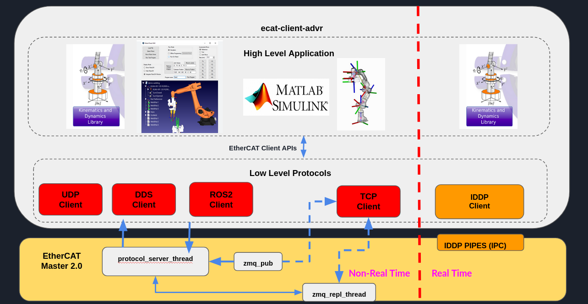
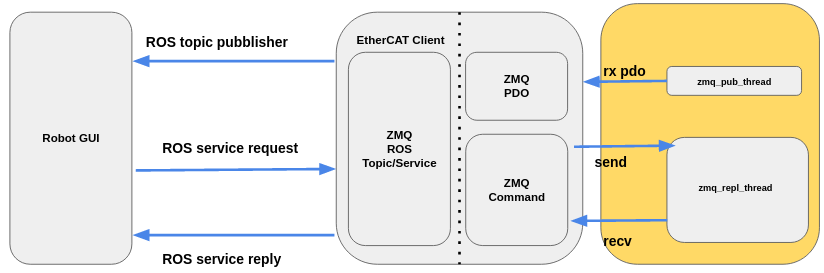
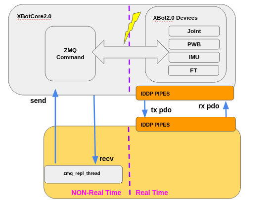
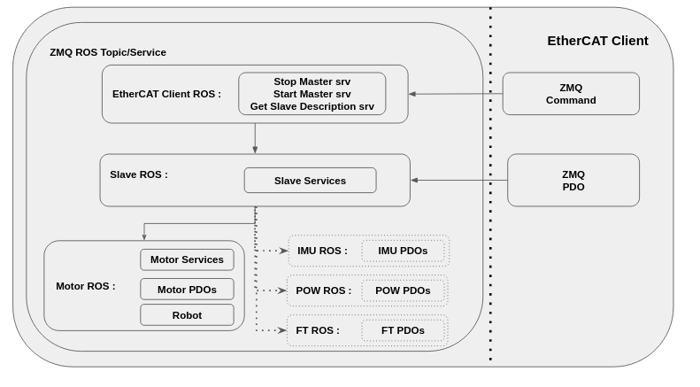
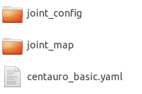
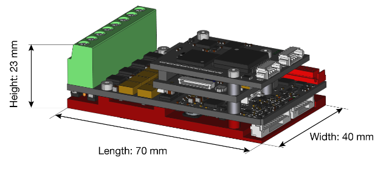

.. _EtherCAT Client:

***************
EtherCAT Client
***************

.. _EtherCAT Client Architecture:

EtherCAT Client Architecture
=============================

The EtherCAT client has three components:

* **ZMQ Command:** Class responsible to send zmq command and receive a reply from the server using the protocol buffer mechanism.
* **ZMQ PDO:** Class responsible to subscribe to a zmq socket containing the Slaves PDOs serialized with protocol buffer.
* **ZMQ Topics and Services:** Working with ROS it's possible to call the classes described before.   

The EtherCAT client communication
--------------------------------------------

ZMQ command class  used inside XBotCore2.0
--------------------------------------------

.. _Code documentation:

Code documentation
=====================================

It's possible to generate the doxygen documentation to read the code of the EtherCAT client::

   doxygen Doxyfile

`Link to the documentation <https://advrhumanoids.github.io/ec_xbot2_client/doxygen/>`__ 

ZMQ Topics and Services Description
--------------------------------------------

* **EtherCAT Client ROS:** Class responsible to open the zmq socket to send and receive the command, open a ROS node handle and expose stop/start the EtherCAT Master and get slave description services.
* **Slave ROS:** Class responsible to configure different slaves, especially for the motors that have a lot information (PID, Max current, Limits and etc...), to open the zmq socket for subscribing the slave's PDOs and to expose the "common" slave services .
* **Motor ROS:** Class responsible to expose the motor services, publish the PDOs and eventually, if the urdf and srdf are present the pose of the robot. 
* **IMU/FT/POW ROS:** Classes responsible to publish the PDOs. 

Slave Configuration files
--------------------------------------------

The suggestion is to create a directory with this sub-directories:

* **joint_config:** Here it's possible to save different slaves configuration files. 
* **joint_map:** File of the slave map (id--->name).
* **"robot_file":** This is an optional file where there are the links to urdf,srdf, model_type and is_model_floating_base information. If this file is present and the user wants to use it, it's better to save the main directory into a workspace where it's possible to find the urdf and srdf.

Motor Setup
--------------------------------------------

This is very important class for our motors:

It has some information for managing the motors:

+-------------------+-----------------------------------------------------------------+
| Motor             | Description                                                     |
| Configuration     |                                                                 |
+===================+=================================================================+
| Motor ID          | ID of the motor.						      |
+-------------------+-----------------------------------------------------------------+
| Motor Name        | Name found into slave id/name map.                              |
+-------------------+-----------------------------------------------------------------+
| Sign              | Conversion for EtherCAT Slaves and the URDF.                    |
+-------------------+-----------------------------------------------------------------+
| Offset            | Conversion for EtherCAT Slaves and the URDF.                    |
+-------------------+-----------------------------------------------------------------+
| Control Mode      | Idle, Position, Velocity or Impedance Control.                  |
+-------------------+-----------------------------------------------------------------+
| Position Gains    | Gains of position control.		                      |
+-------------------+-----------------------------------------------------------------+
| Velocity Gains    | Gains of velocity control. 		                      |
+-------------------+-----------------------------------------------------------------+
| Impedance Gains   | Gains of impedance control.  		                      |
+-------------------+-----------------------------------------------------------------+
| Maximum Current   | Saturation current. 		                              |
+-------------------+-----------------------------------------------------------------+
| Actual Position   | Position command [rad].		                      	      |
+-------------------+-----------------------------------------------------------------+
| Homing Position   | Homing command [rad].		                      	      |
+-------------------+-----------------------------------------------------------------+
| Actual Velocity   | Velocity command [rad/s]. 		                      |
+-------------------+-----------------------------------------------------------------+
| Actual Torqye     | Torque command [Nm]. 		                              |
+-------------------+-----------------------------------------------------------------+
| Actual Amperage   | Amperage command [A].	                              	      |
+-------------------+-----------------------------------------------------------------+
| Motor LED         | Switch ON/OFF motor LED.	                              	      |
+-------------------+-----------------------------------------------------------------+
| Motor FAN         | Switch ON/OFF motor FAN.	                              	      |
+-------------------+-----------------------------------------------------------------+
| Mechanical Limits | Limits of the motor, Minimum/Maximum Position, Maximum Velocity |
|                   | and Maximum Torque.                                             |
+-------------------+-----------------------------------------------------------------+
| C28 Information   | Filename and password of C28 microcontroller.	              |
+-------------------+-----------------------------------------------------------------+
| M3 Information    | Filename and password of M3 microcontroller.	              |
+-------------------+-----------------------------------------------------------------+

