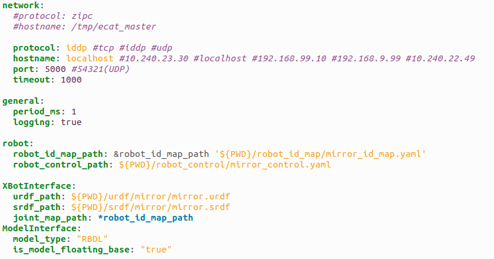
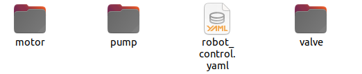
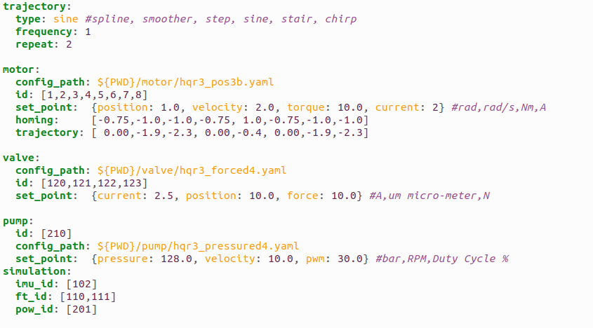
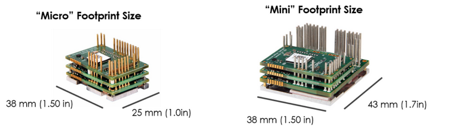

.. _EtherCAT Client:

***************
EtherCAT Client
***************

.. _EtherCAT Client Architecture:

EtherCAT Client Architecture
=============================

.. image:: _static/EtherCAT_Client_Img/EtherCAT_Client_Img_0.png

.. image:: _static/EtherCAT_Client_Img/EtherCAT_Client_Img_1.png

.. _Code documentation:

Code documentation
=====================================

It's possible to generate the doxygen documentation to read the code of the EtherCAT client::

   doxygen Doxyfile

`Link to the documentation <https://advanced-robotics-facility.github.io/ecat-client-advr/doxygen/>`__ 

EtherCAT Client Configuration files
=====================================

The suggestion is to create a directory with this sub-directories:

.. image:: _static/EtherCAT_Client_Img/EtherCAT_Client_Img_2.png

* **ec_cfg.yaml:** This is the main file for setup the EtherCAT Client.
* **robot_control:** Here it's possible to setup the robot control having different slaves that can be controlled (motors,valve,pumps,etc...).
* **robot_id_map:** File of the slave map (id--->name).
* **urdf:** The URDF of the robot that can be used for simulation or by internal libraries for mathematical calculations.
* **srdf:** The URDF of the robot that can be used for simulation or by internal libraries for mathematical calculations.

EtherCAT Cient file
--------------------------------------------

* **network:** Setup the EtherCAT Client network using the TCP/UDP, IDDP (Real-Time Xenomai IPC Pipes) or ZIPC (ZMQ Inter-process) .
* **general:** Setup period and low level logging. **(Optional)**
* **robot:** Setup the robot_control and robot id map paths. **(Optional)** 
* **XBotInterface:** Setup the urdf/srdf for the XBotInterface library. **(Optional)**
* **ModelInterace:** Setup the model characteristics for the ModelInterface library. **(Optional)**

Robot control
--------------------------------------------

* **trajectory:** Setup the trajectory type, frequency and repeat number. (Used by Motors and Valves).
* **motor:** Setup the low level configuration file, ids, set points, homing and general trajectories. **(Optional)**
* **valve:** Setup the low level configuration file, ids, set points, homing and general trajectories. **(Optional)** 
* **pumps:** Setup the low level configuration file, ids, set points, homing and general trajectories. **(Optional)**
* **simulation:** Setup other slaves for the simulation. **(Optional)**

EtherCAT Client Examples
=====================================

* **frequency test:** This example can be used to star the controllers of the slave and increase the period set up in ec_cfg.yaml file (executable argument in micro-second) . **This example was created for testing the UDP protocol.**
* **general trajectory:** This example can be used to start a general trajectory specified in robot control trajectory session.
* **gravity compensation:** This example can be used to send the gravity compensation for the motors.
* **hydraulic:** This example can be used to start a simple quintic degree polynomial trajectory specified in robot control trajectory session for motor,valves and pumps.
* **simple trajectory:** This example can be used to start a simple quintic degree polynomial trajectory specified in robot control trajectory session only for the motors.

**Note:** Using the robot control session, it is possible to run the examples starting the controller of the specific slave with its control mode and set point using the its ID.

**Important:** A generic user can write its example code simpling adding the CMakeLists.txt the ec_library, **find_package(ec_library)** adding in the target_link_libraries **ec_library::ec_library**

