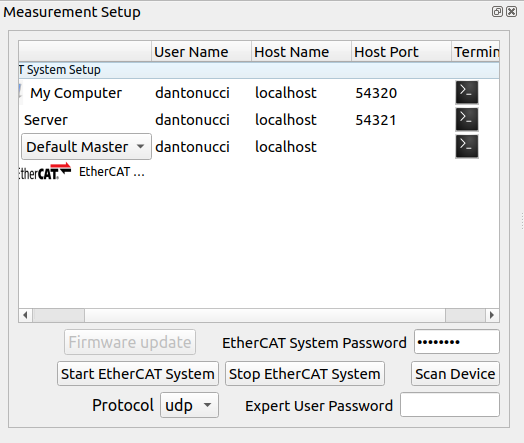
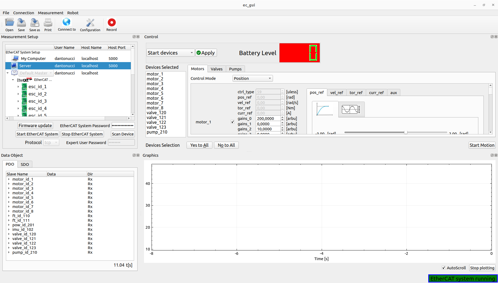
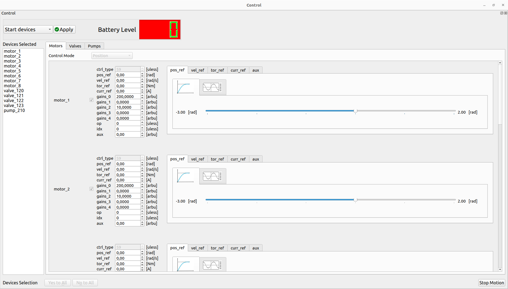
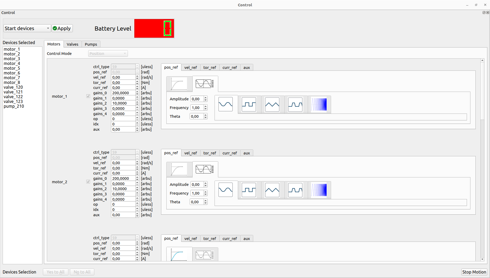

.. _EtherCAT Client GUI:

*********************
EtherCAT Client GUI
*********************

.. _EtherCAT GUI Architecture:

Software architecture
=============================

.. image:: _static/EtherCAT_Client_GUI_Img/EtherCAT_Client_GUI_Img_1.png

The main class of the GUI is the EcGuiStart. This one is responsible to build up all GUI components shown in the picture. 
Two sub-classes are used for different scopes:

* **EcGuiFirmware:** This class is responsible to flash the firmware of the EtherCAT slaves.
* **EcGuiNet:** This class is responsible to create the connection with the EtherCAT Master.
* **EcGuiWrapper:** This class has different components working with EtherCAT Client created inside the EcGuiStart class:

  * **EcGuiCmd:** This class is used to start/stop the controllers for the EtherCAT slaves that can be controlled such as motors,valve,pumps etc....
  * **EcGuiPdo:** This class is used to send PDOs and receiving/plotting them.
  * **EcGuiSdo:** This class is used to read and write SDOs, research them, save and open configuration files (**EcGuiSdoWizard** Class) and use the flash commands. 
  * **EcLogger:** This class is used to log/record the PDOs created in the Ec Client library.

.. _EtherCAT Client GUI Code documentation:

Code documentation
========================================

It's possible to generate the doxygen documentation to read the code of the EtherCAT client GUI::

   doxygen Doxyfile

`Link to the documentation <https://advanced-robotics-facility.github.io/ecat-client-advr/gui/>`__ 

Measurement setup
========================================

.. image:: _static/EtherCAT_Client_GUI_Img/EtherCAT_Client_GUI_Img_2.png

The user can setup the EtherCAT system network using the **Server row**, specifying **the user name, host name/ip and port (UDP: 54321, TCP: 5000)**. Furthermore, it's possible to choose which kind of EtherCAT Master application has to be run on Embedded PC:

* **Default Master:** Standard EtherCAT master (repl).
* **Robot Master:** EtherCAT master (repl) specifying the low level setup (used on robot).
* **Ecat Master:** EtherCAT master (repl) specifying the low level setup (used on robot).

Once the user has setup the EtherCAT system adding the **EtherCAT System password** and choosing **the protocol (udp, tcp, ros2 not available yet)**, it's possible to start it:

.. image:: _static/EtherCAT_Client_GUI_Img/EtherCAT_Client_GUI_Img_3.png

**Note:** At the bottom right the user can check the status of the system.

It's also possible to verify EtherCAT system status using the terminals opened during the starting phase, or clicking the terminal buttons in the Terminal column:

**Note:** It's possible to open the client terminal launching **ec_gui_log** instead of using the **ec_gui** where it's not possible to log the terminal.

Now the user can start EtherCAT Client by clicking the **Scan Device button** initializing the GUI:

.. image:: _static/EtherCAT_Client_GUI_Img/EtherCAT_Client_GUI_Img_5.png

**Important:  The user can use the Scan device button if the EtherCAT system was already started externally on the Embedded PC**.

**Note:**  The user can decide to rescan the device whenever necessary:

.. image:: _static/EtherCAT_Client_GUI_Img/EtherCAT_Client_GUI_Img_6.png

The EtherCAT Client is started and can check the EtherCAT system status, in case of communication problem a pop-up will appear, moving the status of not running:

.. image:: _static/EtherCAT_Client_GUI_Img/EtherCAT_Client_GUI_Img_7.png

In this case the user can restart the EtherCAT system following the previous procedure. 

The user can **stop EtherCAT system** by clicking the stop button.

Firmware update
========================================

This feature is possible to use it only in **expert mode** inserting the **Expert User Password**:
 
.. image:: _static/EtherCAT_Client_GUI_Img/EtherCAT_Client_GUI_Img_8.png

**Important: The password can be delivered to expert users**.

By clicking the firmware update button the Firmware wizard will appear:

.. image:: _static/EtherCAT_Client_GUI_Img/EtherCAT_Client_GUI_Img_9.png

* **Select all bin or config files:** This button helps the user to select all binaries (.bin) or configuration (.csv) files for flashing. 

`i.e  Firmware update on Synapticon driver. <https://doc.synapticon.com/circulo/tutorials/foe_drive_operations.html?tocpath=Resources%7CTutorials%7C_____2/>`__

* **Copy file to embedded PC:** Copy all files to embedded PC inside **.ecat_master/firmware/** directory.
* **Open firmware configuration file:** This button will open the **.ecat_master/configs/microCTRL_config.yaml** file of the embedded PC. This is used by the firmware update procedure for flashing the specific device.
* **Start firmware update:** This button will start the firmware update procedure: 

Data Object and Graphics
========================================

Process Data Object (PDO)
--------------------------------------------

The user can check and plot the process data object:

.. image:: _static/EtherCAT_Client_GUI_Img/EtherCAT_Client_GUI_Img_11.png

The user can select which field of the PDO and device to plot by **checking the box** inside the PDO table.
It's also possible to stop the **auto-scroll** and clear the plotting by clicking the **stop plotting button**.
Furthermore, by clicking the record button on top the GUI the user can log the Rx-Tx PDOs.

Service Data Object (SDO)
--------------------------------------------

.. image:: _static/EtherCAT_Client_GUI_Img/EtherCAT_Client_GUI_Img_12.png

The user can work with the SDOs for monitoring the devices behaviour. Selecting the device (**Yes/No to All buttons** help for this procedure), it's also possible:

* Read again the SDOs by clicking the **Rescan** button 
* Save all SDOs into **.csv file** for all EtherCAT slave selected using **Save SDO file** button.
* **Search the SDOs**, typing a specific content of them:

.. image:: _static/EtherCAT_Client_GUI_Img/EtherCAT_Client_GUI_Img_13.png

The expert user, inserting the **Expert User Password** (See Firmware Update session), can also **Open SDO File** calibrating the devices selected and use the **flashing features**:

.. image:: _static/EtherCAT_Client_GUI_Img/EtherCAT_Client_GUI_Img_14.png

The **Open SDO File** button helps the expert user to select the specific .csv file launching the **Calibration wizard**:

.. image:: _static/EtherCAT_Client_GUI_Img/EtherCAT_Client_GUI_Img_15.png

Selecting the SDO (**Yes/No to All buttons** help for this procedure) and by clicking the Finish button, the SDOs writing function is called, verifying the correct values by rescaning the SDOs automatically. 

The **flashing features** can be used for:

* **Restore the default** constructor parameters from the flash to the RAM of the EtherCAT slaves.
* **Load** the parameters from the flash to the RAM of the EtherCAT slaves.
* **Save** the parameters from the RAM to the flash of the EtherCAT slaves.

Control
========================================

The user can start or stop the controllers of the devices that can be controlled like motors, valves or pumps, by clicking **Start devices** or **Stop devices**.
It's necessary, for the starting phase, select the device in every tab (**Yes/No to All buttons** help for this procedure),its gains and the control mode. 
All devices selected will be shown into the **Devices Selected** list box.

If the starting phase has a success result, it's possible to Start the motion using the specific button:

.. image:: _static/EtherCAT_Client_GUI_Img/EtherCAT_Client_GUI_Img_17.png

The user can decide to perform the trajectory using the **simple slider** or **wave generator** by selecting the specific tab:

For the wave generator, the user can select the **wave type (Sine, Square, Triangle, Trapezoidal and Chirp), amplitude, frequency and phase**.
It's possible to change on fly all the parameters during the motion.

The user can stop the motion by clicking the **Stop Motion** or **Stop devices** buttons. This allows also to change the trajectory type (slider/wave geneator) and restart the motion if the devices are still controlled.

**Note:** It's also possible to use **spin box** together with the slider for sending new values of the PDOs. Some of them have only that box for sending new values (i.e gains etc...).
If the user uses the wave generator for a specific PDO, its spin box is disabled.
