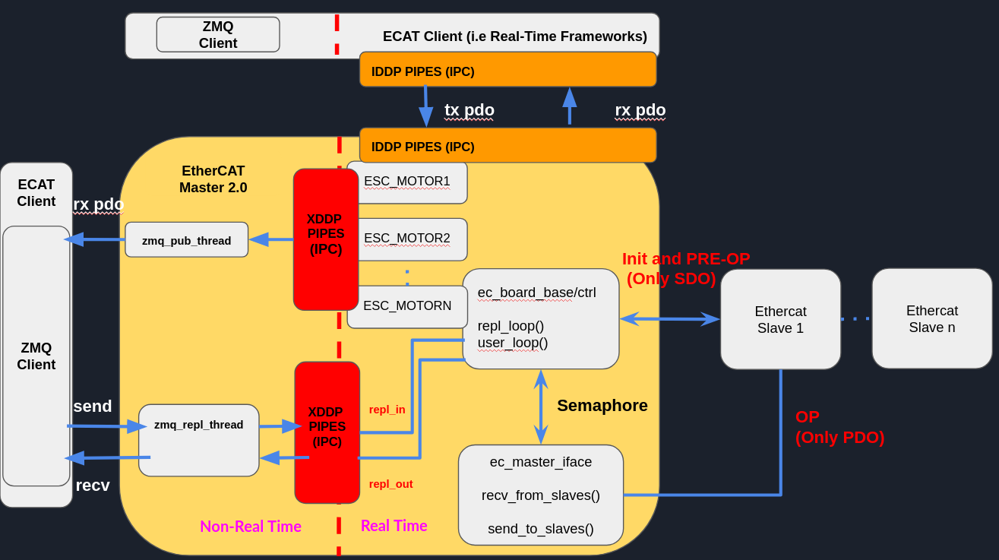

.. EtherCAT Client documentation master file, created by
   sphinx-quickstart on Tue Mar  2 17:17:41 2021.
   You can adapt this file completely to your liking, but it should at least
   contain the root `toctree` directive.

Welcome to ADVR-F EtherCAT Client's documentation!
=====================================================

EtherCAT Client is an application which different mechanisms and communication protocols to communicate with the ADVR-F EtherCAT Master server:

.. image:: _static/EtherCAT_Client_Img/EtherCAT_Client_Img_0.png

EtherCAT Server:

It's possible to compile and run the EtherCAT client and server in real-time with Xenomai and Preempt-RT real-time operating system:

.. image:: _static/Real_Time_OS/Real_Time_OS_Img_0.png
.. image:: _static/Real_Time_OS/Real_Time_OS_Img_1.png

Compatible with different types of motors, IIT HHCM Research Line, Somanet Circulo-Node and AMC FlexPro:

`HHCM motor documentation <https://hhcm.iit.it/it/robot-hardware>`__ 

.. image:: _static/EtherCAT_Client_Img/EtherCAT_Client_Img_3.png

`Somanet Circulo documentation <https://doc.synapticon.com/circulo/technical_specs/tech_specs_circulo.html?tocpath=Technical%20specifications%7C_____0>`__ 

.. image:: _static/EtherCAT_Client_Img/EtherCAT_Client_Img_4.png

`Somanet node 400 documentation <https://doc.synapticon.com/node/technical_specs/tech_specs_node.html>`__ 

.. image:: _static/EtherCAT_Client_Img/EtherCAT_Client_Img_5.png

`AMC Flex-Pro documentation <https://www.a-m-c.com/experience/products/servo-drives/flexpro/>`__ 

.. image:: _static/EtherCAT_Client_Img/EtherCAT_Client_Img_6.png

Contents:

.. toctree::
   :maxdepth: 2

   background.rst
   installation.rst
   ec_client.rst
   ec_client_gui.rst
   ec_client_block.rst

Indices and tables
==================

* :ref:`genindex`
* :ref:`modindex`
* :ref:`search`
