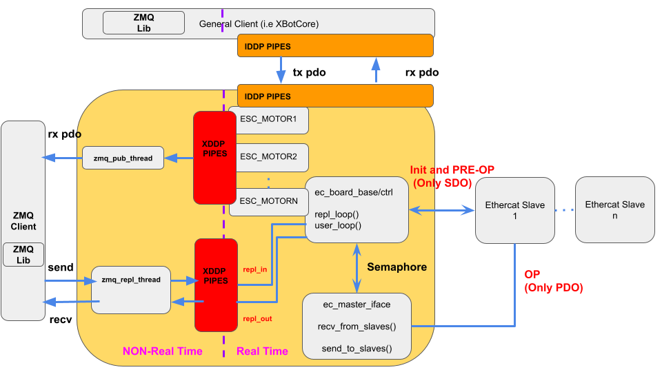
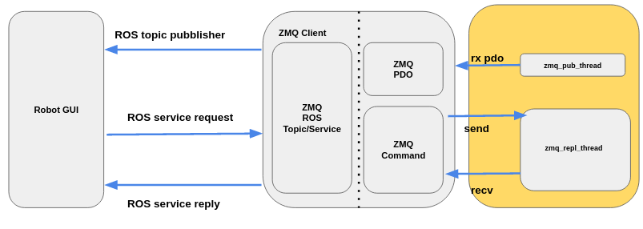

.. EtherCAT Client documentation master file, created by
   sphinx-quickstart on Tue Mar  2 17:17:41 2021.
   You can adapt this file completely to your liking, but it should at least
   contain the root `toctree` directive.

Welcome to EtherCAT Client's documentation!
===========================================

EtherCAT Client is an application which uses the ZMQ and Protocol buffer mechanisms to communicate with the EtherCAT Master server:

It works with an internal library that uses different commands in order to perform some operations on the server. Futhermore, it's possible to receive Real time data from it. The "upper layer" of the library exploits the ROS topics/services mechanism to talk with an external enviroment such graphical user interface (GUI): 

Contents:

.. toctree::
   :maxdepth: 2

   background.rst
   installation.rst
   ec_client.rst
   robot_gui.rst

Indices and tables
==================

* :ref:`genindex`
* :ref:`modindex`
* :ref:`search`
