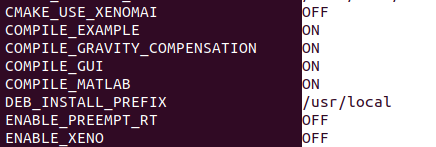

.. _Installation:

***************
Installation
***************

.. _Git and CMake:

Git and CMake
=============================

Install git package::

   sudo apt update
   sudo apt install -y git gitg git-gui
   git --version
   sudo apt install -y file build-essential curl cmake cmake-curses-gui

.. _MatLogger:

MatLogger
=============================

Install matlogger library::

   sudo apt install -y libmatio-dev libfmt-dev libgtest-dev python3-pip python3-pybind11
   git clone https://github.com/ADVRHumanoids/MatLogger2  (actual branch: v1.5.0)

.. _Zmq, Protobuf, Msgpack, Boost:

Zmq, Protobuf, Msgpack, Boost
=============================

Install mechanism protocols::

   sudo apt-get install -y libzmq3-dev
   sudo apt install protobuf-compiler
   sudo apt install libmsgpack-dev
   sudo apt-get install libboost-system-dev
   
.. _YAML:

YAML
================================

Install yaml utils::

   sudo apt install libyaml-cpp-dev

.. _QT and GUI Tools:

QT and GUI Tools
========================================

Install GUI tools::

  sudo apt install -y  qttools5-dev libqt5charts5-dev qtdeclarative5-dev libtiff-dev uuid-dev libcurl4-openssl-dev
  
.. _Matlab and Simulink:  
  
Matlab and Simulink
========================================

Install Matlab/Simulink tools::

  sudo dpkg --install ecat-client-advr/src/matlab/ec_block/external/blockfactory/(OS)/blockfactory_package-0.8.3-r0.0.1-amd64.deb

.. _Build and install the EtherCAT Client Library from sorce:  

Build and install the EtherCAT Client Library from sorce
==========================================================

Prepare the workspace::
  ecat-client-advr/scripts/.create_ws.sh [name_ws] [dir_ws, default=HOME]
  
Source into .bashrc the new workspace::

  source ~/name_workspace/setup.bash 

Download and compile EtherCAT Client::

  cd src/

  git clone https://github.com/Advanced-Robotics-Facility/ecat-client-advr
  
  cd ../build 
  mkdir -p ecat-client-advr && cd ecat-client-advr
  (compile and build the client)

Note: Select the variable to compile (EtherCAT Client Examples an Gravity compensation, the EtherCAT Client GUI and EtherCAT client block [Matlab/Simulink]):

**Note: It's possible to compile the EtherCAT Client Library with Xenomai Real-Time OS or Preempt-RT Real Times OS.**

.. _Install the EtherCAT Client Library from debian package:  

Install the EtherCAT Client Library from debian package
==========================================================

Download from this site the last version of EtherCAT Client Debian Package and install it::

   https://github.com/Advanced-Robotics-Facility/ecat-client-advr/releases

Install EtherCAT Client Librarys::

  sudo dpkg --install ecat-client-advr_nrt_package-0.0.1-r0.0.1-amd64.deb
