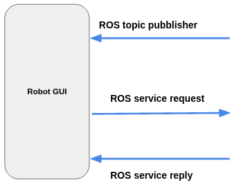
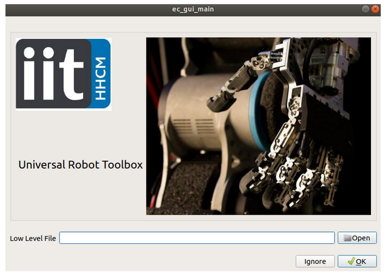
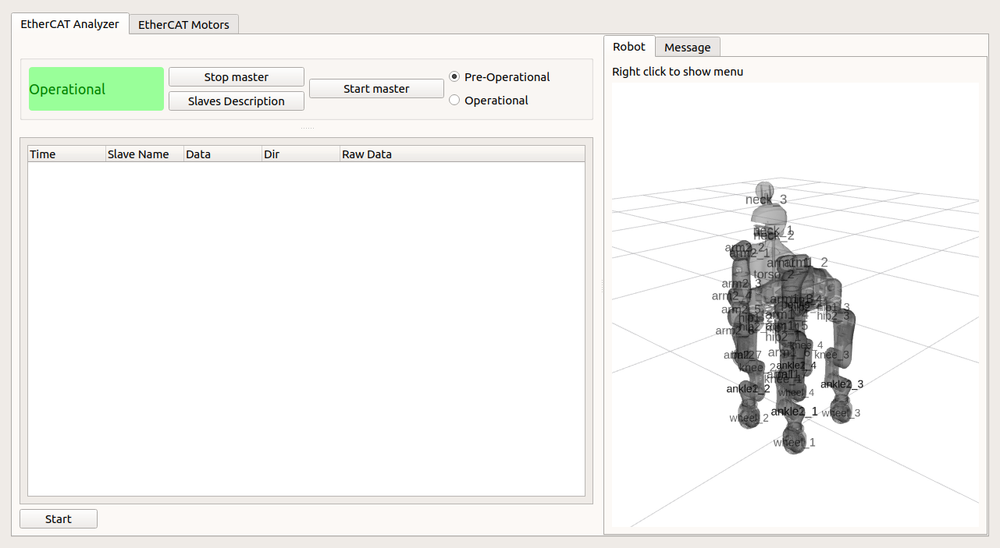
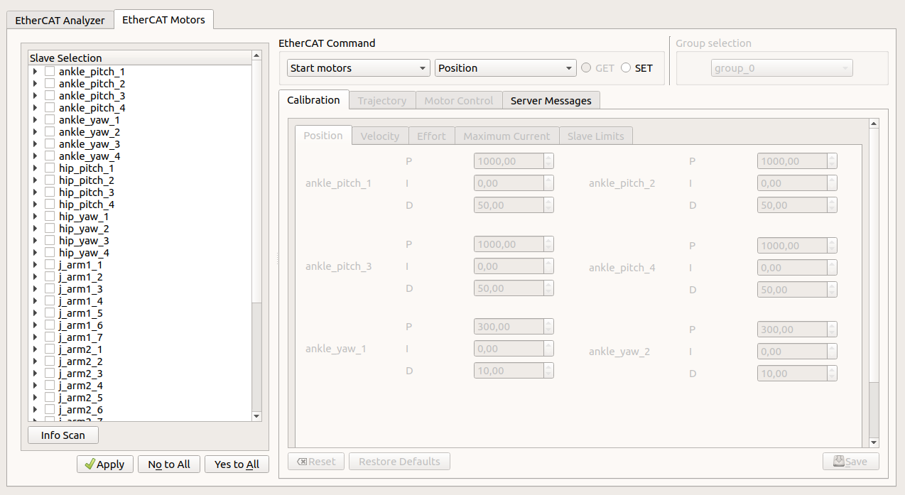
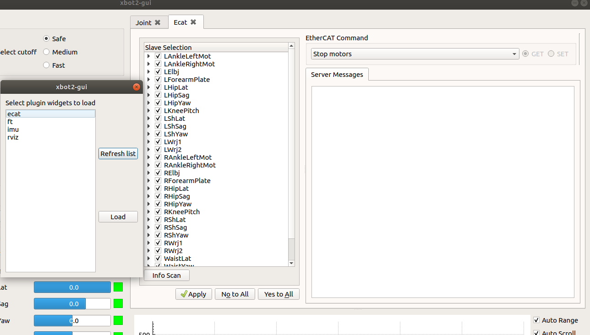

.. _Robot GUI:

***************
Robot GUI
***************

.. _Robot GUI Communication:

Robot GUI Communication
=============================

   
.. _Universal Robot Toolbox:

Universal Robot Toolbox (Robot GUI)
===================================

Initial Setup
--------------------------------------------

This operation allows the user to setup the EtherCAT Client with a new robot.

.. image:: _static/EtherCAT_Client_Img/EtherCAT_Client_Img_4.png

* **joint_config:** Slaves configuration files. 
* **joint_map:** File of the slave map (id--->name).
* **"robot_file":** Optional file where there are the links to urdf,srdf, model_type and is_model_floating_base information.

Note: The ignore button is used if the EC Client is already configured.

EtherCAT Analyzer
--------------------------------------------

This page allows the user to SCAN the PDOs from EtherCAT Master Server, check the robot position and send main EtherCAT Master commands to the server verifying the reply on the Message Tab.

Stop Master Command
^^^^^^^^^^^^^^^^^^^^^

Prerequisites: 

* EtherCAT Master started **pre-operational or operational** with or without slaves detected.

Start Master Command
^^^^^^^^^^^^^^^^^^^^^

Options: 

* Pre-operational.
* Operational.

Prerequisites: 

* EtherCAT Master started **pre-operational or operational** with or without slaves detected.

Get Slaves Description Command
^^^^^^^^^^^^^^^^^^^^^^^^^^^^^^^^
Prerequisites: 

* EtherCAT Master started **pre-operational or operational** with the slaves detected.

Message Tab
^^^^^^^^^^^^^^^^^^^^^^^^^^^^^^^^

This Tab shows the reply of the EtherCAT Master Server or the communication errors with it.

Stop and Start EtherCAT Analyzer
^^^^^^^^^^^^^^^^^^^^^^^^^^^^^^^^^^^^

Prerequisites: 

* EtherCAT Master started in **operational** with the slaves detected.
* **Press Get Slaves Description button for knowing the slaves type.**

Note: 

* This operation should be done ONLY once when the EtherCAT Master server detected ALL slaves.   

EtherCAT Motors
--------------------------------------------

This page allows the user to SCAN all information of the motors (Firmware, Mechanical Limits, Gains, Current control information and Motor Status), START/STOP, CALIBRATE and CONTROL the motors, and send and perform TRAJECTORIES. It's possible to check the reply and communication errors of EtherCAT Master server by using the Server message tab. 

Slave Selection Area
^^^^^^^^^^^^^^^^^^^^^^^^^^^^^

In this Area is possible to select the slaves for performing the commands by pressing the Apply button, furthermore using Yes_to_All or Not_to_All buttons is possible to select or deselect all slaves.

Info Scan
^^^^^^^^^^^^^^^^^^^^^

Prerequisites: 

* EtherCAT Master started **pre-operational or operational** with slaves detected.

Note: 

* To receive the gains different to zeros the EtherCAT Master have to be in operational and the motors started.
* The motors status is always to Unknown because the EtherCAT Master doesn't send the status of them.   

Group Selection
^^^^^^^^^^^^^^^^^^^^^^^^^^^^^

During the calibration, motor control and trajectory phase it's possible to switch different group of slaves.   

Start Motors
^^^^^^^^^^^^^^^^^^^^^

Options: 

* Position Control.
* Velocity Control.
* Impedance Control.

Prerequisites: 

* EtherCAT Master started in **operational** with the slaves detected.

Note: 

* It's possible to calibrate the motors giving new values of the Gains by pressing the SET Button, using the Calibration tab and switching the controllers (Position, Velocity and Impedance).

Stop Motors
^^^^^^^^^^^^^^^^^^^^^

Prerequisites: 

* EtherCAT Master started in **operational** with the slaves detected.

SDO Information
^^^^^^^^^^^^^^^^^^^^^

Prerequisites: 

* EtherCAT Master started **pre-operational or operational** with slaves detected.          

Gains
^^^^^^^^^^^^^^^^^^^^^

Prerequisites (GET/SET which means CALIBRATION): 

* EtherCAT Master started **pre-operational or operational** with slaves detected.   

Note: 

* It's possible to calibrate the motors giving new values of the Gains by pressing the SET Button, using the Calibration tab and switching the controllers (Position, Velocity and Impedance).

Slave Limits
^^^^^^^^^^^^^^^^^^^^^

Prerequisites (GET): 

* EtherCAT Master started **pre-operational or operational** with slaves detected.

Prerequisites (SET which means CALIBRATION): 

* EtherCAT Master started **pre-operational** with slaves detected.    

Note: 

* It's possible to GET the slave limits informantion in **pre-operational or operational**.
* It's possible to calibrate the motors giving new values of the Slave Limits by pressing the SET Button using the Calibration Tab.

Current
^^^^^^^^^^^^^^^^^^^^^

Prerequisites (GET): 

* EtherCAT Master started **pre-operational or operational** with slaves detected.

Prerequisites (SET which means CALIBRATION): 

* EtherCAT Master started **pre-operational** with slaves detected.    

Note: 

* It's possible to GET the current control informantion (PID and Maximum Current) in **pre-operational or operational**.
* It's possible to calibrate the motors giving a new value of the Maximun Current  by pressing the SET Button using the Calibration Tab.

Firmware
^^^^^^^^^^^^^^^^^^^^^

Prerequisites (GET): 

* EtherCAT Master started **pre-operational or operational** with slaves detected.

Prerequisites (SET which means CALIBRATION): 

* EtherCAT Master started **pre-operational** with slaves detected.    

Note: 

* It's possible to GET the firmware informantion in **pre-operational or operational**.
* It's possible to flash a new firmare of the motors by pressing the SET Button using the Slave Selection Area:
  
  * In the Slave Selection Area is possible to select the c28 and m3 files and transfert it into the EtherCAT Master Server PC using the ssh protocol. The file will be transfered in this directory: ~/.ecat_master/firmware.
  * It's necessary to insert the passwords for c28 (0xDAD0) and m3 (0xA550) microcontrollers.

Save, Load and Load default parameters
^^^^^^^^^^^^^^^^^^^^^^^^^^^^^^^^^^^^^^

Prerequisites (SET which means CALIBRATION): 

* EtherCAT Master started **pre-operational** with slaves detected. 

Note: 

* It's possible to save parameters to the motor flash by using Save button when the CALIBRATION Phase is completed.
* It's possible to load parameters from the motor flash by using Reset button overriding the CALIBRATION values.
* It's possible to load by default parameters from the motor flash by using Restore Defaults button overriding the CALIBRATION values.

Motor Control
^^^^^^^^^^^^^^^^^^^^^

Prerequisites (SET):

* EtherCAT Master started **operational** with slaves detected. 
* Motor started.   

Note: 

* It's possible to control the motors setting new values by pressing the SET Button, using the Motor control tab and switching on different setting types (Position, Velocity, Torque, Amperage, Homing Position, LED and FAN).

Trajectory
^^^^^^^^^^^^^^^^^^^^^

Prerequisites (SET):

* EtherCAT Master started **operational** with slaves detected. 
* Motor started.   

Note: 

* It's possible to send the trajectories to the motors by pressing the SET Button, using the Trajectory tab and switching on different trajectory types (Homing, Sine and Smooth).
* This function uses an internal mechanism to define the name of the trajectory to send to EtherCAT Master Client and Server: 

  * home_trj+_slaves_name;
  * sine_trj+_slaves_name;
  * smooth_trj+_slaves_name;

Start or Clear the Trajectory
^^^^^^^^^^^^^^^^^^^^^^^^^^^^^

Prerequisites (SET):

* EtherCAT Master started **operational** with slaves detected. 
* Motor started.   

Note: 

* It's possible to start and clear the trajectories to the motors by pressing OK or Cancel buttons.

Server Message Tab
^^^^^^^^^^^^^^^^^^^^^^^^^^^^^^^^

This Tab shows the reply of the EtherCAT Master Server or the communication errors with it.

XBot2-GUI Integration 
=============================

Part of the Univarsal Robot Toolbox can be added like a plugin.

Another important GUI is used in the Lab, XBot2-GUI, where it's possible to load dynamically different plugins:
 

Note:

* When XBotCore node is running a lot of services of the EtherCAT client are inhibited:

  * Start motors.
  * Motors Calibration (all SET commands, Gains, Slave Limits, Current and Firmware).
  * Motors Control.
  * Motors Trajectory.
* When XBotCore node is running, it's possible to use the stop motors command for ALL motors.

